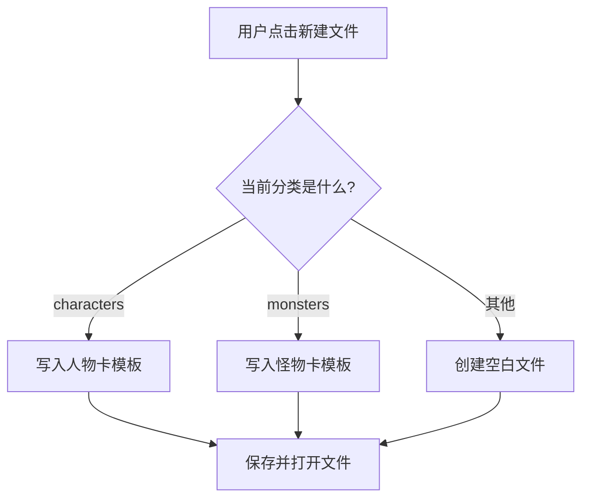

# Design Document

## Overview

本设计文档描述了如何为DND跑团管理器添加人物卡和怪物卡的模板功能，同时优化现有UI界面。设计采用最小侵入性原则，在保持现有架构的基础上扩展功能。

## Architecture

保持现有的单文件架构，仅在必要处进行最小修改：

1. **模板内容**：在现有的`create_file`方法中添加模板字符串
2. **简单UI改进**：调整现有按钮和布局的基本样式
3. **分类判断**：在文件创建时根据当前分类生成对应模板



## Components and Interfaces

### 简化实现方案

直接在现有的`App`类中添加：

```python
def get_template_content(self, category):
    """根据分类返回模板内容，如果不需要模板则返回空字符串"""
    if category == "characters":
        return "姓名: \n\n种族: \n\n职业: \n\n技能: \n\n装备: \n\n背景: \n\n"
    elif category == "monsters":
        return "姓名: \n\nCR: \n\n属性: \n\n攻击: \n\n特性: 无\n\n"
    return ""
```

## Data Models

### 模板内容（硬编码字符串）

**人物卡模板：**
```
姓名: 

种族: 

职业: 

技能: 

装备: 

背景: 
```

**怪物卡模板：**
```
姓名: 

CR: 

属性: 

攻击: 

特性: 无
```

### UI改进（最小化修改）

只调整必要的样式参数：
- 按钮间距和字体
- 框架的内边距
- 保持现有颜色方案
```

## Correctness Properties

*A property is a characteristic or behavior that should hold true across all valid executions of a system-essentially, a formal statement about what the system should do. Properties serve as the bridge between human-readable specifications and machine-verifiable correctness guarantees.*

### Property 1: 模板内容正确性
*For any* 人物卡文件创建，应包含姓名、种族、职业、技能、装备、背景字段
**Validates: Requirements 1.2**

### Property 2: 怪物卡模板正确性
*For any* 怪物卡文件创建，应包含姓名、CR、属性、攻击、特性字段，特性默认为"无"
**Validates: Requirements 2.2**

### Property 3: 向后兼容性
*For any* 现有功能，在添加模板功能后应保持正常工作
**Validates: Requirements 5.2, 5.4**

## Error Handling

保持简单的错误处理：
- 如果模板生成失败，回退到空白文件
- 保持现有的文件创建错误处理逻辑

## Testing Strategy

### 简化测试方法

**基本功能测试**：
- 验证人物卡和怪物卡模板内容正确
- 确保现有功能不受影响
- 测试文件创建和保存功能

**手动测试**：
- UI改进效果
- 文件编辑器自动打开功能

不引入复杂的测试框架，保持测试简单实用。